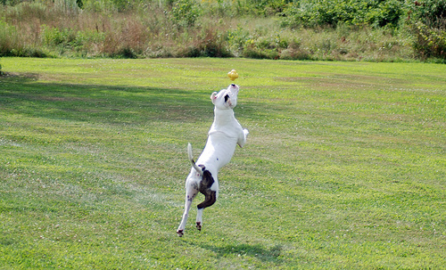
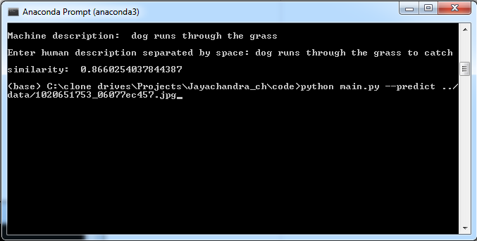

***

# Image-Text similarity

A system that uses machine learning to predict the similarity between a pair of objects (e.g. text and image). 

## Dependencies

This work requires:

Python 3.6 and the following libraries installed:

* [Jupyter](http://jupyter.org/)
* [NumPy](http://www.numpy.org/)
* [Pandas](http://pandas.pydata.org/)
* [scikit-learn](http://scikit-learn.org/)
* [Scikit-image](https://scikit-image.org/)
* [keras](https://www.tensorflow.org/guide/keras)
* [Tensorflow](https://www.tensorflow.org/)
* [NLTK](https://www.nltk.org/)

These libraries can be installed using pip. To install the latest version of a package, use: pip install "package name"

Alternatively, install Anaconda distribution. This will install all the required libraries for this challenge including Jupyter notebooks. 

## Run Instructions

- Change to the code directory in the unzipped folder. 

To check image-text similarity for an image in the data folder use the below command-line

python main.py --predict ../data/1020651753_06077ec457.jpg

The program first displays the caption for the given input image. It then asks human description of the given image as an input. The cosine similarity score is finally displayed by comparing the machine and human description of the image. 

Sample output of image and text similarity is shown below.

## Project files

- The complete training pipeline is given in the notebook. Please go through the notebook (Image Captioning.html file) provided under the notebooks directory to get a complete understanding of the machine learning steps used for model training.

- The code directory has two python files (main.py and utilities.py) which has the code to compare the image-text similarity
- The data directory has 10 sample images to test the code. 
- The artifacts directory has two text files and model weights (pretrained inceptinV3 and RNN within the code. It also has a sample output file (Output.png).
- A report document is provided which explains the approach taken to solve the problem and the future work is also indicated.

